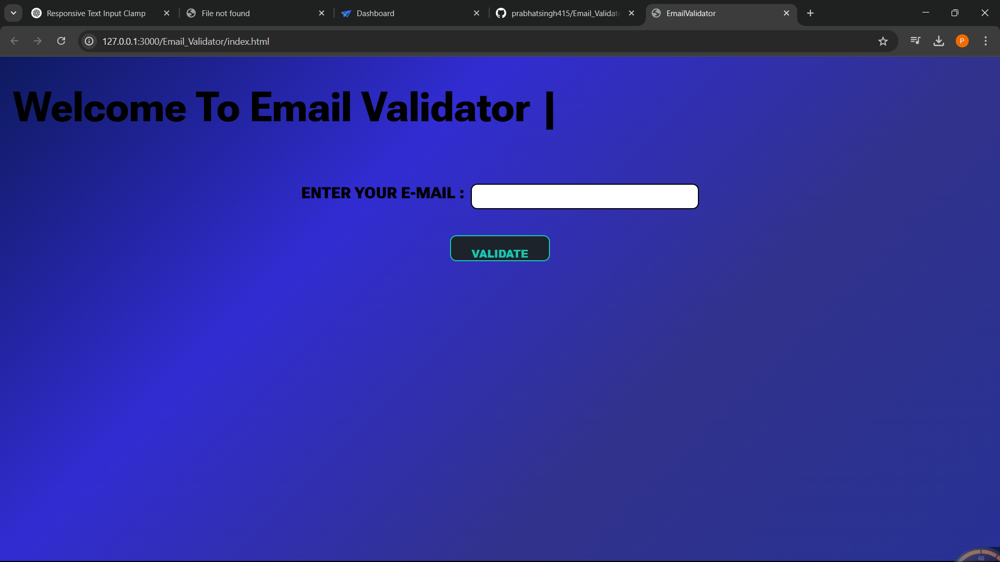

# Email Validator

## 📌 Description

A simple web application that allows users to validate email addresses using the EmailValidation.io API. Users can enter an email address and receive details about its validity, type, and other metadata.

## 🚀 Features

- Validate email addresses instantly
- Displays detailed information about the email
- Clean and responsive UI
- Real-time loading animation while fetching results

## 🛠️ Technologies Used

- **HTML** - Structure of the webpage
- **CSS** - Styling for a user-friendly UI
- **JavaScript** - Logic for handling API requests and dynamic content

## 📷 Screenshots



## 🎯 How to Use

1. Enter an email address in the input field.
2. Click the **Validate** button.
3. The application will fetch data from the EmailValidation.io API.
4. The result table will display the details of the email address.

## 🔑 API Key Setup

This project uses **EmailValidation.io** API. Replace `apiKey` in `script.js` with your own API key:

```js
const apiKey = "YOUR_API_KEY_HERE";
```

## 🐛 Troubleshooting

- If the API does not return results, ensure that your API key is valid.
- Check your console (`F12` in browser) for any JavaScript errors.
- Make sure you have an internet connection.

## 🙌 Acknowledgments

- EmailValidation.io for providing the API

## 💡 Future Enhancements

- Improve UI/UX for better readability
- Add email validation history feature
- Enhance error handling

---

### 👨‍💻 Developed by Prabhat Singh
